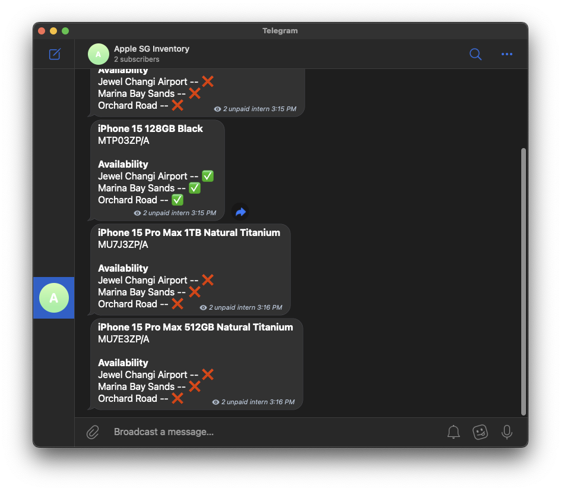

# Apple SG Inventory Notifier

Telegram bot that notifies you when the Apple Store in Singapore has the product you want in stock.



> [!IMPORTANT]
> Refer to `tracking_request.json` to view the models that are currently being tracked.
>
> Feel free to open an issue or submit a pull request to add more models to track.

## Tech Stack

- [Go v1.21](https://golang.org/)
- [GCP Cloud Function](https://cloud.google.com/functions) for serverless execution
- [GCP Cloud Scheduler](https://cloud.google.com/scheduler) for scheduling execution
- [Telegram Bot API](https://core.telegram.org/bots/api) for sending notifications
<!-- - [MongoDB Atlas](https://www.mongodb.com/cloud/atlas) for data persistence -->

> [!NOTE]
> For the full details, feel free to read in the [devlog](https://github.com/yusufaine/apple-notifier/blob/main/assets/devlog.md).

### Local development and testing

```bash
FUNCTION_NAME=apple_notifier go run cmd/localcf/main.go
# Alternatively, use the .env file
# env $(cat .env | xargs) go run cmd/localcf/main.go
```

### Deploying

```bash
FUNCTION_NAME=apple_notifier go run cmd/zipcf/main.go
# Alternatively, use the .env file
# env $(cat .env | xargs) go run cmd/zipcf/main.go
```

1. Zip the cloud function using the command above
2. Upload the zip file to the cloud function
3. Set the cloud scheduler to send a HTTP POST request with the `tracking_request.json` as the body to the cloud function

#### Tracking other Apple Stores

You can also run your own instance of the bot to track models from other countries, though I've only managed to ensure that this works for Apple stores in Singapore and Hong Kong.

> Hong Kong Apple stores example

```json
{
  "abbrev_country": "hk",
  "country": "hong kong",
  "models": ["MU7J3ZP/A", "MU7E3ZP/A", "MU793ZP/A"]
}
```
