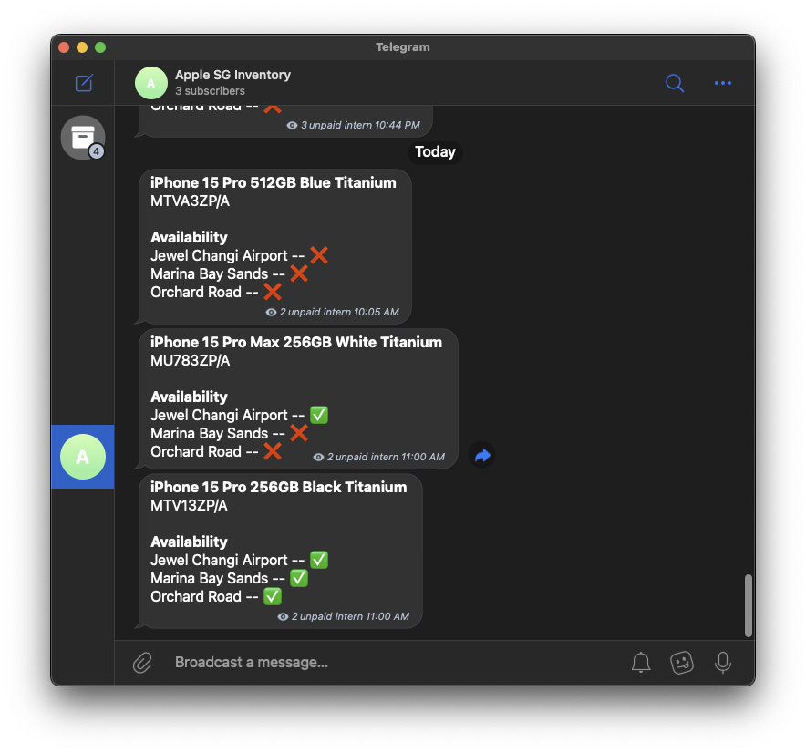

# Apple SG Inventory Notifier

Telegram bot that notifies you when the Apple Store in Singapore has the product you want in stock.



> [!IMPORTANT]
> Refer to `tracking_request.json` to view the models that are currently being tracked.

## Tech Stack

- [Go v1.21](https://golang.org/)
- [GCP Cloud Function](https://cloud.google.com/functions) for serverless execution
- [GCP Cloud Scheduler](https://cloud.google.com/scheduler) for scheduling execution
- [Telegram Bot API](https://core.telegram.org/bots/api) for sending notifications
<!-- - [MongoDB Atlas](https://www.mongodb.com/cloud/atlas) for data persistence -->

<!-- > [!NOTE]
> For the full details, feel free to read [in the companion article](./assets/article.md). -->

### Local development and testing

```bash
FUNCTION_NAME=apple_notifier go run cmd/localcf/main.go
# Alternatively, use the .env file
# env $(cat .env | xargs) make testcf
```

### Deploying

Zip the cloud function with the function target name and deploy it to GCP Cloud Functions via the web console.

```bash
FUNCTION_NAME=apple_notifier go run cmd/zipcf/main.go
# Alternatively, use the .env file
# env $(cat .env | xargs) make zipcf
```

## Contributions

To add more models to track, please submit a pull request with the updated `tracking_request.json` file.
