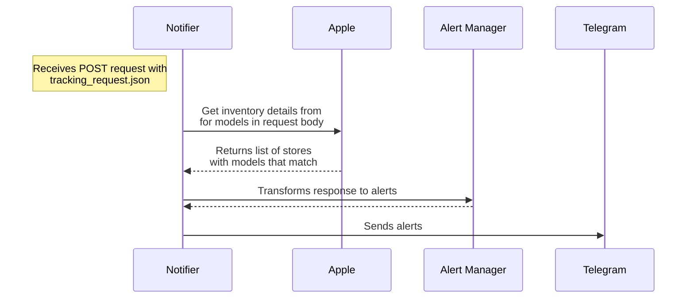
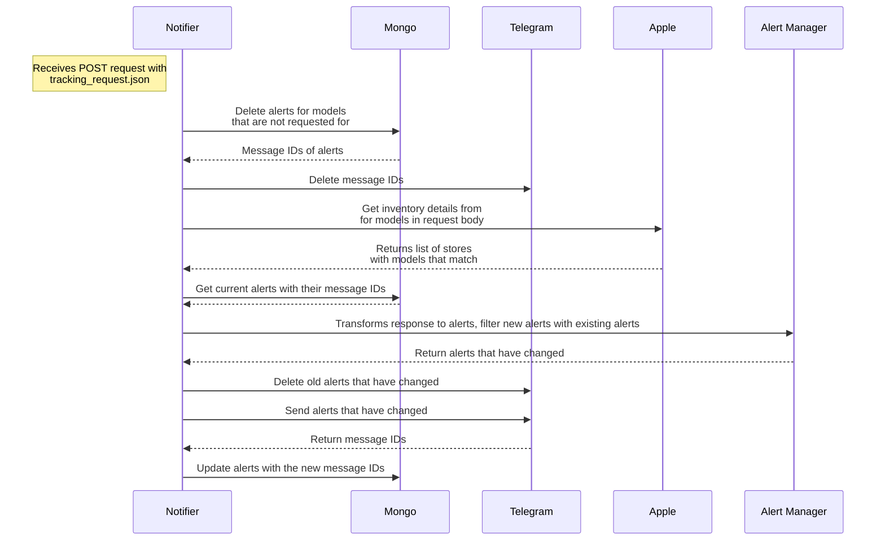

# iPhone 15 Pro Max: The extent I go to get my hands on one

<!-- omit in toc -->
## Table of Contents

- [Background](#background)
- [Tech details](#tech-details)
  - [Tech considerations](#tech-considerations)
  - [Flow](#flow)
    - [Version 1: Eager updates](#version-1-eager-updates)
    - [Version 2: Lazy updates](#version-2-lazy-updates)
- [Takeaways](#takeaways)
  - [1. Start with a TDD](#1-start-with-a-tdd)
  - [2. Explicitly setting checkpoints](#2-explicitly-setting-checkpoints)
  - [3. Working with public APIs responsibly](#3-working-with-public-apis-responsibly)

## Background

When the iPhone 15 lineup was announced, I was ready to make an impulsive purchase because of 1 main reason. As of writing, I've been to several concerts this year (IVE and TWICE 🔛 🔝 btw) and considering the limited space of my base model iPhone 13 Pro, and decent-ish zoom quality, I wanted to get the [iPhone 15 Pro Max](https://support.apple.com/kb/SP904?locale=en_US) for the 5x optical zoom, and the USB-C 3.0 port to quickly offload the photos and videos I've taken, and also allow directly storing 4k60 videos on an external storage.

> Is this a financially sound decision?

Probably not.

> Why not get `<insert_android_phone>` instead?

Apple vs. Android war aside, I'm neck-deep in the Apple ecosystem and I don't want to deal with the hassle of switching and the bottomless pit of customisability of Android. I went down that rabbit hole of custom ROMs once with the Samsung Galaxy S4 yesteryears ago and I don't want to go back there again.

Alas, as the time came for pre-orders, I was either too slow or the demand was too high, and the delivery date was pushed back to 2 months later. So, instead of checking the delivery date every day, I decided to hire an intern to do it for me.

> The joke here is that the telegram bot's name is `unpaid intern`.

## Tech details

From this section onwards, I'll be detailing the journey of how I built this project from start to "good enough" (because nothing is truly "finished") including the tech stack, implementation details, and the thought process behind it. The goal of this is simply to document my thought process and the decisions I made, and hopefully it'll be useful to someone else.

### Tech considerations

When coming up with this application, I was very certain about ensuring 1 thing — granularity. The application should allow to easily update what models are being tracked and how frequent the polling interval should be, and I've chosen to use Google's Cloud Schedule to schedule sending HTTP POST requests with the payload of the models to track.

As such, the tech stack is as follows:

|                                                           | **Purpose/Rationale**                                                             |
| --------------------------------------------------------- | --------------------------------------------------------------------------------- |
| [**Go**](https://golang.org/)                             | Easy setup, easy to use, my grug brain like ([*context*](https://grugbrain.dev/)) |
| [**Telegram**](https://core.telegram.org/bots/api)        | Go-to messaging app commonly used by Singaporeans, supports broadcast channels    |
| [**Cloud Function**](https://cloud.google.com/functions)  | Generous free tier, pay for what you use                                          |
| [**Cloud Scheduler**](https://cloud.google.com/scheduler) | Setup cron jobs with HTTP POST                                                    |
| [**MongoDB Atlas**](https://www.mongodb.com/cloud/atlas)  | Data persistence to easily track alerts sent, easy setup                          |

I've also considered hosting the application on fly.io as a single-run execution but decided against it as the scheduling mechanism is not as robust or as fine-grained (not cron-like).

### Flow

The flow of the application may not exactly be accurate but the gist of it is as follows.

#### Version 1: Eager updates

#### Version 2: Lazy updates

> [!NOTE]
> This is in production!

## Takeaways

With this weekend project reaching a stable-ish state, there are somethings that I've learnt along the way that I feel are transferable to other projects.

### 1. Start with a TDD

Admittedly, I did NOT do this at the start of this project, and I dove straight into the code. I had a rough idea of what I wanted to do, but I didn't think through the details of how the application should work, and I ultimately had to scrap the progress I made and start over. While some parts were reusable, I had to rewrite a lot of the code to fit the new flow of the application.

So don't be like me, start with a TDD. It doesn't have to be anything formal like what you see in school or at work, but it should help you scope out the requirements of the project and flesh out the flow of the application.

### 2. Explicitly setting checkpoints

> Checkpoints, to-dos, milestones, etc. Whatever you want to call it, they achieve the same thing.

While this is related to [the point above](1-start-with-a-tdd), I feel like this is (personally) important enough to warrant its own point.

Something that I've noticed about myself is that I can get overwhelmed very easily as I always want to try and optimise the solution as much as possible the first try, and ultimately crumble when things go south. So the thing I did (after scraping the first attempt) was to set checkpoints for the project.

In this sense, I define checkpoints to be working states of the application which was condensed into the sequence diagrams in [the flow section](#flow), but were as follows:

- [ ] Get inventory details from Apple and figure out how to parse the response, and format the message
- [ ] Setup [telegram alerts channel](https://t.me/applesg_notifier) and test that the bot is working
- [ ] Setup Cloud Function and Scheduler and test that the bot is working
- [ ] Setup MongoDB and store alerts to allow lazy updates

### 3. Working with public APIs responsibly

Typically public APIs would state the constraints of the API, like in the case of Telegram's bot API, which I only found out after I was rate limited for sending too many messages (its 20 messages per minute, by the way).

When it comes to hidden/undocumented public APIs, the details of what can be sent in the request params and response bodies aren't well-defined, so there's a lot of trial and error involved. Thankfully, the API allowed me to send a list of models to check for so I only need to send 1 request instead of bombarding their endpoint with requests for every single model. Something to keep in mind as well is that if the API were to change, the application would break, so just keep that in mind.
