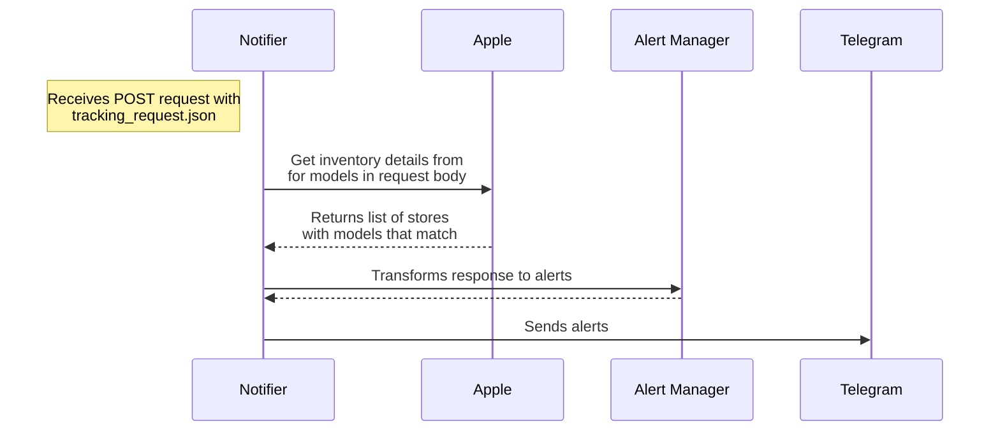
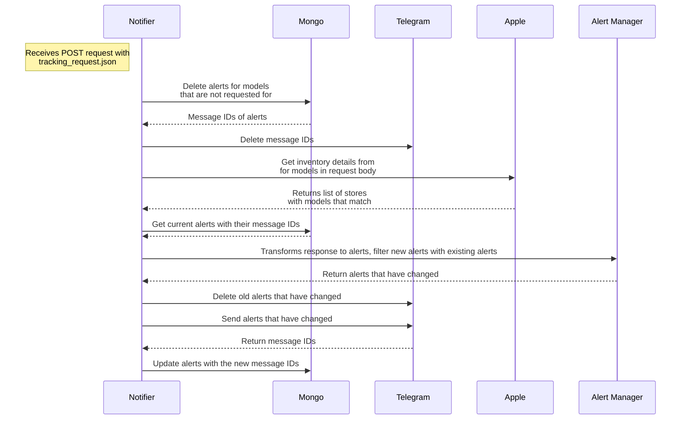

# iPhone 15 Pro Max: The extent I go to get my hands on one

<!-- omit in toc -->
## Table of Contents

- [Background](#background)
- [Tech details](#tech-details)
  - [Tech considerations](#tech-considerations)
  - [Flow](#flow)
    - [Version 1: Eager updates](#version-1-eager-updates)
    - [Version 2: Lazy updates](#version-2-lazy-updates)

## Background

When the iPhone 15 lineup was announced, I was ready to make an impulsive purchase because of 1 main reason. As of writing, I've been to several concerts this year (IVE and TWICE 🔛 🔝 btw) and considering the limited space of my base model iPhone 13 Pro, and decent-ish zoom quality, I wanted to get the [iPhone 15 Pro Max](https://support.apple.com/kb/SP904?locale=en_US) for the 5x optical zoom, and the USB-C 3.0 port to quickly offload the photos and videos I've taken, and also allow directly storing 4k60 videos on an external storage.

> Is this a financially sound decision?

Probably not.

> Why not get `<insert_android_phone>` instead?

Apple vs. Android war aside, I'm neck-deep in the Apple ecosystem and I don't want to deal with the hassle of switching and the bottomless pit of customisability of Android. I went down that rabbit hole of custom ROMs once with the Samsung Galaxy S4 yesteryears ago and I don't want to go back there again.

Alas, as the time came for pre-orders, I was either too slow or the demand was too high, and the delivery date was pushed back to 2 months later. So, instead of checking the delivery date every day, I decided to hire an intern to do it for me.

> The joke here is that the telegram bot's name is `unpaid intern`.

## Tech details

From this section onwards, I'll be detailing the journey of how I built this project from start to "good enough" (because nothing is truly "finished") including the tech stack, implementation details, and the thought process behind it. The goal of this is simply to document my thought process and the decisions I made, and hopefully it'll be useful to someone else.

While writing this article, I realised the importance of writing (some semblance of) a technical design document (TDD) before starting on a project. Had I written a TDD and mulled over the details for while longer instead of diving straight into the code, I would've saved myself a lot of time and effort.

### Tech considerations

When coming up with this application, I was very certain about ensuring 1 thing — granularity. The application should allow to easily update what models are being tracked and how frequent the polling interval should be, and I've chosen to use Google's Cloud Schedule to schedule sending HTTP POST requests with the payload of the models to track.

As such, the tech stack is as follows:

1. [Go v1.21](https://golang.org/) for the programming language, easy setup
2. [MongoDB Atlas](https://www.mongodb.com/cloud/atlas) for data persistence, easy setup
3. [Telegram Bot API](https://core.telegram.org/bots/api) for sending alerts, go-to messaging app
4. [GCP Cloud Function](https://cloud.google.com/functions) for serverless execution
5. [GCP Cloud Scheduler](https://cloud.google.com/scheduler) for cron-like scheduling

I've also considered hosting the application on fly.io as a single-run execution but decided against it as the scheduling mechanism is not as robust or as fine-grained (not cron-like).

### Flow

The flow of the application may not exactly be accurate but the gist of it is as follows.

#### Version 1: Eager updates

> [!NOTE]
> This version is currently in production.

#### Version 2: Lazy updates

> [!NOTE]
> This version is currently in development.

<!-- ## Takeaways -->
<!-- TODO: After completing version 2 -->
